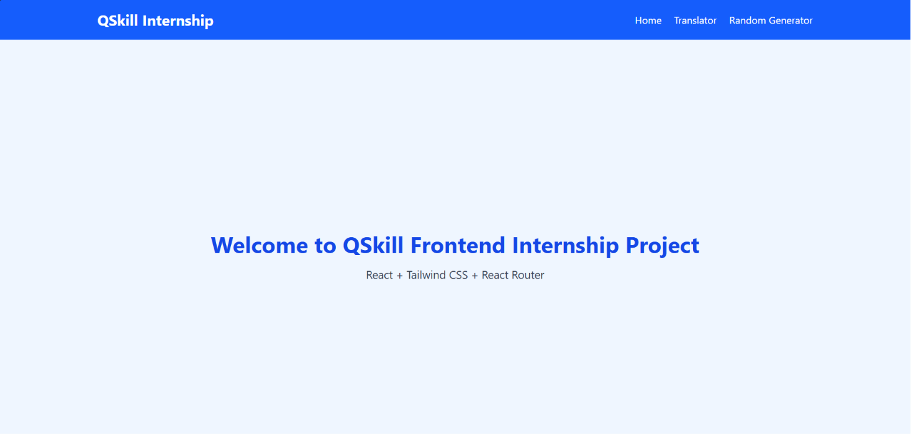
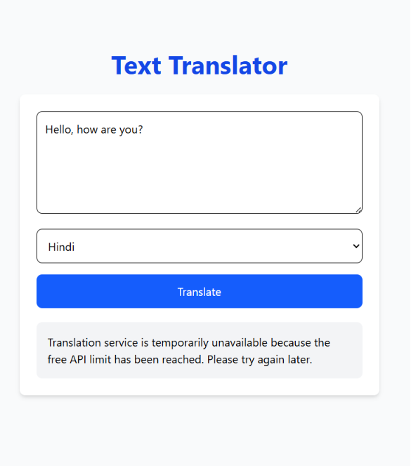

# 🌐 AI Text Translator

An AI-powered text translation web application built with React, Vite, Tailwind CSS, and RapidAPI. The application enables users to translate text into multiple languages through a clean, responsive, and user-friendly interface.

## Features

- Translate text into multiple languages
- Fast and accurate translations using RapidAPI
- Clean and responsive user interface
- Mobile-friendly design
- Built with React functional components and Hooks
- Real-time translation experience

## Technologies Used

- React.js
- Vite
- Tailwind CSS
- JavaScript (ES6+)
- RapidAPI
- HTML5
- CSS3

## Project Structure

```text
ai-text-translator-react/
├── public/
├── src/
│   ├── components/
│   ├── pages/
│   ├── App.jsx
│   └── main.jsx
├── package.json
├── vite.config.js
└── README.md
```
## Getting Started

1. Clone the repository

```bash
git clone git@github.com:vishakha-code27/ai-text-translator-react.git
```

2. Navigate to the project folder

cd ai-text-translator-react

3. Install dependencies

npm install

4. Start the development server

npm run dev

## Project Screenshots

###  Home Page



###  Translator Page



###  Random Generator Page


## Learning Outcomes

This project helped me learn:

- React fundamentals
- React Hooks (`useState`, `useEffect`)
- Client-side routing
- API integration using RapidAPI
- Environment variables (`.env`)
- Responsive UI development with Tailwind CSS
- Git and GitHub version control

## Author

Vishakha Chavan

GitHub: https://github.com/vishakha-code27

---

